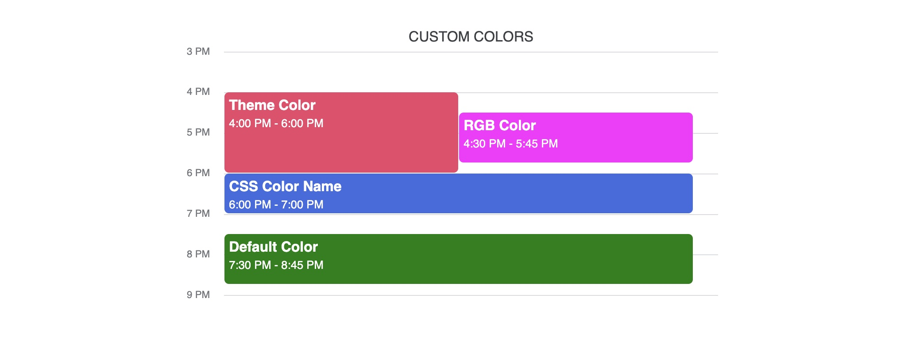

# Event Tiles

## Colors

Colors for each tile can be optionally given in the day schedule event data. This package includes both Apple and Google colors that can be used, but you can also use any CSS color value (RGB, HEX, color name, etc.). If no color is given, the theme's default color (blue) will be used.

To change the default tile color, provide a `defaultTileColor` value in the theme. This can be a CSS color value or a function that returns a CSS color value given the event.

```typescript
const data: DaySchedule[] = [
  {
    name: "Custom Colors",
    events: [
      {
        startTime: 16,
        endTime: 18,
        title: "Theme Color",
        color: colors.apple.red,
      },
      {
        startTime: 16.5,
        endTime: 17.75,
        title: "RGB Color",
        color: "rgb(255, 0, 255)",
      },
      {
        startTime: 18,
        endTime: 19,
        title: "CSS Color Name",
        color: "royalblue",
      },
      {
        startTime: 19.5,
        endTime: 20.75,
        title: "Default Color",
      },
    ],
  },
];
```

```tsx
<ScheduleView
  theme={createTheme("google", { defaultTileColor: "green" })}
  daySchedules={data}
  viewStartTime={15}
  viewEndTime={21}
/>
```



## Custom Components

To use a fully custom component for each tile, pass a React component to either `customTileComponent` or `themeTileContent` on the ScheduleTheme. This component will be passed the `CalendarEvent` data for its specific event through an `event` prop.

- `customTileComponent` will override the component used to render each tile
- `themeTileContent` will only override the content inside of each tile. This is useful if you want to keep the style of the component that comes with one of the included themes, but display additional custom content.

If you need to access the current theme from within the custom component or content, use the `ThemeContext`.

```typescript
const theme = useContext(ThemeContext);
```

## Custom CalendarEvent Properties

CalendarEvent can contain additional data you can use when rendering custom tiles. For example, you could provide a `location` for each event in addition to title, description, color, etc. To render additional data, provide a custom component (see above) in the theme, then access the data through the event prop.
